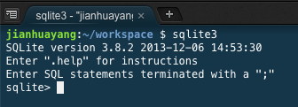
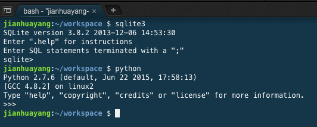
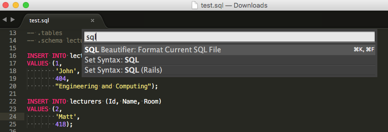

# Database

In this lab, you'll do some SQL excercies using C9 and SQLite. The purpose of these exercises is to get yourself familiar with CRUD and other SQL operations using SQLite as the database engine. Most modern websites rely on some sort of databases either SQL or NoSQL. This includes the Python based web framwork Flask, whichi is the focus of the remaing part of the module.


> Some comparisons of SQL and NoSQL on [Sitepoint](http://www.sitepoint.com/sql-vs-nosql-differences/). Click for the official documentation on [Using SQLite 3 with Flask](http://flask.pocoo.org/docs/0.10/patterns/sqlite3/).

There're two parts in this current lab: 

1. SQLite. This current mdoule assumes no prior knowledge of SQL. I understand some of you have done SQL before in 104KM, or doing it right now in 220CT. Bare in mind that SQL has different flovors. Being very powerful and popular, SQLite is different from other implementations such as MySQL. 
    
    > Click [here](https://www.digitalocean.com/community/tutorials/sqlite-vs-mysql-vs-postgresql-a-comparison-of-relational-database-management-systems) to see a comparison of SQLite vs MySQL vs PostgreSQL.
    > Click [here](https://github.com/covcom/388COM/tree/master/Week_06_Data_persistence#lab-2-sqlite-databases) to see an example of using SQLite in Android, which is 388COM another module I teach.
    
2. HTML local storage. If you are confident with the SQLite part, you can quickly move on to this second part, which is considered to be a 'bonus'. You'll see how HTML introduce APIs that allow the browser to save some data locally, mainly for the purpose of offline apps.

## SQLite

SQLite is in its latest version 3 at the moment. It doesn't require installation. Once you're in your C9 workspace, open a terminal and type in `sqlite3`. What you'll see is something like this



The command prompt `$` has changed to `sqlite>`. This means you're inside sqlite now, you can start typing SQL commands. Hit `ctrl` + `d` to quit the SQLite environment. This is very similar to Python.



SQLite3 is available on Linux and Mac, what if I use Windows? OK, you got me. I don't nomrally use SQLite3 directly on a Windows machine. I reckon you have a look at [SQLiteStudio](http://sqlitestudio.pl/). This software should be available on all EC machines through software portal.

### CRUD operations

CRUD stands for create, read, update, and delete. It's a common set of operations we use to manipulate SQL data.

**Create**

Go into the terminal again, and issue the following command

```bash
sqlite3 test.db
```

This should create a new file test.db in your current folder, which is `workspace`. This new file is the container of your tables/views etc. And it can be copied/moved into other locations, as it's just an ordinary file (unlike MySQL).

Issue the following command in SQLite environment

```sql
CREATE TABLE lecturers (
  Id integer PRIMARY KEY, 
  Name text NOT NULL, 
  Room integer, 
  Building text DEFAULT 'Engineering & Computing' 
  );
```

There're several things going on in the code above:
* It creates a table with 4 columns. In this example, it shows staff ID, room number etc.
* In SQL we don't distinguish between lower and upper case letters. The reason that reserved words use all upper cases are for convension only.
* Each SQL statement must terminate using a semicolon ';'.
* Code above should create a table with 4 columns. `integer` and `text` are data types supported by SQLite. Other data types supported by SQLite are real, null and blob.
* PRIMARY KEY and NOT NULL, and DEFAULT are examples of constaint. Other constaints include UNIQUE, FOREIGH KEY, and CHECK.

We can use the *dot commands* to verify the table and its schema. These *dot commands* are specific to SQLite, and it can be used for many differnt purposes such as exporting data from a table. Click [here](https://www.sqlite.org/cli.html) for more examples.

```sql
sqlite> .tables
lecturers
sqlite> .schema lecturers
CREATE TABLE lecturers (
  Id integer PRIMARY KEY, 
  Name text NOT NULL, 
  Room integer, 
  Building text DEFAULT 'Engineering & Computing' 
  );
```

**Insert**

Run the following commands to insert some data into the table you just created

```sql
INSERT INTO lecturers
VALUES (1,
        'John',
        404,
        "Engineering and Computing");

INSERT INTO lecturers (Id, Name, Room)
VALUES (2,
        'Matt',
        418);

INSERT
OR
REPLACE INTO lecturers (id, name, room)
VALUES (3,
        'Carl',
        305);

INSERT INTO lecturers (Name)
VALUES ('Carl');
```

Here we used 4 differnt syntax to do the insertion, depending if you wnat to insert all 4 columns and if you want to use default values or not. Note in the last case we didn't supply an id. Because the Id column was declared as `integer primary key`, SQLite will treat it as *autoincrement*.

> In the example above, I used Sublime Text with 'SQL Beautifier' to do formatting. If you want to format your code properly like this, you'll need to use some formatters as by default C9 doesn't have on built-in.



The insertion resutls can be verified in the following

```sql
sqlite> SELECT * FROM lecturers;
1|John|404|Engineering and Computing
2|Matt|418|Engineering & Computing
3|Carl|305|Engineering & Computing
4|Carl||Engineering & Computing
```

**Delete** and **Update**

Delete and Update can be done in a simple manner

```sql
DELETE
FROM lecturers
WHERE id=4;

UPDATE lecturers
SET building = 'EC'
WHERE id=3;
```

In the code above, we delete the duplicated row No.4 and update building column of row No.3 to be 'EC'. Note that normally in programming languages `=` is used for assignment and `==` is used for testing equality. But in SQL we don't distinguish between the two. The results can be verified using ``.

**More on Create**

One of the advantages (or disadvantages you may say) of SQLite is that you don't have to specify data type. The system will cast for you when needed, as in the example below:

```sql
sqlite> CREATE TABLE l2 (Id, Name);
sqlite> 
sqlite> INSERT INTO l2
   ...> VALUES (2,
   ...>         'Steve');
sqlite> 
sqlite> SELECT Id + 100
   ...> FROM l2
   ...> WHERE id=2;
102
sqlite> 
sqlite> SELECT Id || 100
   ...> FROM l2
   ...> WHERE id=2;
2100
```

In this example, we didn't specify data type of Id column. The system automatically cast type for us depends on if we need integer (+) or text (||).

Another way to create table is to create based on data returned from queries run on other table. We'll look at queries in a minute

```sql
CREATE TABLE l3 AS
SELECT *
FROM lecturers
WHERE id>1;
```

## Drop and Alter

The following commands show you how to drop a table, or drop table in a 'sensitive' manner. That is, check if it exists first and then drop it.

```sql
DROP TABLE l2;

DROP TABLE IF EXISTS l3;
```

After creation, you can change certain aspects of a table. But SQLite offers few options as opposed to MySQL. 
> In SQLite it is not possible to rename a column, remove a column, or add or remove constraints from a table.

```sql
ALTER TABLE lecturers RENAME TO l1;

ALTER TABLE l1 ADD COLUMN Age integer;
```

Code above rename the table we first created to l1 (lecturers 1) and adds a column called Age.

Now run the following commands to insert data into this new column, and add an additional row for later use

```sql
UPDATE l1
SET age=30
WHERE id =1;

UPDATE l1
SET age=38
WHERE id =2;

UPDATE l1
SET age=38
WHERE id =3;

INSERT INTO l1
VALUES(4,
       'Steve',
       301,
       'EC',
       28);
```

 our table l1 looks like this:

```sql
sqlite> SELECT * FROM l1;
1|John|404|Engineering and Computing|30
2|Matt|418|Engineering & Computing|38
3|Carl|305|EC|38
4|Steve|301|EC|28
```

This doesn't look very nice. Use `.mode` and `.header` *dot commands* to change the output format to make it more appealling.

```sql
sqlite> .mode column
sqlite> .headers on
sqlite> SELECT * FROM l1;
Id          Name        Room        Building                   Age       
----------  ----------  ----------  -------------------------  ----------
1           John        404         Engineering and Computing  30        
2           Matt        418         Engineering & Computing    38        
3           Carl        305         EC                         38        
4           Steve       301         EC                         28        
```

### Queries

#### Simple selection

The power of SQL lies within queries. With it you can do almost everything you want.

Run the following queries on table l1 and examine different outputs.

```sql
sqlite> SELECT *
   ...> FROM l1;
Id          Name        Room        Building                   Age       
----------  ----------  ----------  -------------------------  ----------
1           John        404         Engineering and Computing  30        
2           Matt        418         Engineering & Computing    38        
3           Carl        305         EC                         38        
4           Steve       301         EC                         28        
sqlite> 
sqlite> SELECT id,
   ...>        name,
   ...>        room,
   ...>        age
   ...> FROM l1;
Id          Name        Room        Age       
----------  ----------  ----------  ----------
1           John        404         30        
2           Matt        418         38        
3           Carl        305         38        
4           Steve       301         28        
sqlite> 
sqlite> SELECT name AS 'Full Name'
   ...> FROM l1;
Full Name 
----------
John      
Matt      
Carl      
Steve     
sqlite> 
sqlite> SELECT *
   ...> FROM l1 LIMIT 1,
   ...>               2;
Id          Name        Room        Building                 Age       
----------  ----------  ----------  -----------------------  ----------
2           Matt        418         Engineering & Computing  38        
3           Carl        305         EC                       38        
sqlite> 
sqlite> SELECT *
   ...> FROM l1
   ...> ORDER BY room;
Id          Name        Room        Building    Age       
----------  ----------  ----------  ----------  ----------
4           Steve       301         EC          28        
3           Carl        305         EC          38        
1           John        404         Engineerin  30        
2           Matt        418         Engineerin  38        
sqlite> 
sqlite> SELECT *
   ...> FROM l1
   ...> WHERE age < 35;
Id          Name        Room        Building                   Age       
----------  ----------  ----------  -------------------------  ----------
1           John        404         Engineering and Computing  30        
4           Steve       301         EC                         28        
sqlite> 
sqlite> SELECT DISTINCT age
   ...> FROM l1;
Age       
----------
30        
38        
28        
sqlite> 
```

Most examples above are self explanary. Note in code `SELECT * FROM l1 LIMIT 1, 2;`, '2' is total number of records we want to display, and '1' is the offset. Basically we want to skip the 1st one and see 2 rows in total.

#### SQLite functions

Instead of simply selecting rows that meet certain critera, what you can also do is to perform some simple calculations from query results. Fucntions provided by SQLite is not as comprehensive as other SQL flavours such as MySQL (sometimes makes you feel frustrating). But in most of the cases you'll access SQLite through APIs using languages such as Python. So this becomes less of an issue.

```sql
sqlite> SELECT max(age),
   ...>        min(age)
   ...> FROM l1;
max(age)    min(age)  
----------  ----------
38          28        
sqlite> 
sqlite> SELECT 'employ name: ' || Name AS Name,
   ...>                           age
   ...> FROM l1;
Name               Age       
-----------------  ----------
employ name: John  30        
employ name: Matt  38        
employ name: Carl  38        
employ name: Stev  28        
sqlite> 
sqlite> SELECT count(*)
   ...> FROM l1;
count(*)  
----------
4         
sqlite> 
sqlite> SELECT avg(age)
   ...> FROM l1;
avg(age)  
----------
33.5      
sqlite> 
sqlite> SELECT group_concat(name),
   ...>        age
   ...> FROM l1
   ...> GROUP BY age;
group_concat(name)  Age       
------------------  ----------
Steve               28        
John                30        
Matt,Carl           38        
```

In all examples above, the functions operate on columns. That is, inputs to those functions are the columns in your table. This is why we need to have structured data for SQL databases.

The last example, `GROUP BY` belongs to a group of functions called aggregate functions. I found it particularly useful when you want to provide a summary your data records according to some certain criteria. 

Another set of functions that are useful when you work with JS are called JSON function. Click [here](https://www.sqlite.org/json1.html) for a comprehensive list from the official documentation website. 

### Advanced features


#### Some house keeping

```sql
CREATE TABLE building (Room, Capacity);

INSERT INTO building
VALUES(404,
       3);

INSERT INTO building
VALUES(418,
       5);

INSERT INTO building
VALUES(305,
       2);
```

```sql
sqlite> SELECT * FROM building;
Room        Capacity  
----------  ----------
404         3         
418         5         
305         2    
```


#### Join

```sql
sqlite> SELECT *
   ...> FROM l1
   ...> JOIN building ON l1.Room=building.Room;
Id          Name        Room        Building                   Age         Room        Capacity  
----------  ----------  ----------  -------------------------  ----------  ----------  ----------
1           John        404         Engineering and Computing  30          404         3         
2           Matt        418         Engineering & Computing    38          418         5         
3           Carl        305         EC                         38          305         2         
sqlite> 
sqlite> SELECT *
   ...> FROM l1
   ...> INNER JOIN building ON l1.Room=building.Room;
Id          Name        Room        Building                   Age         Room        Capacity  
----------  ----------  ----------  -------------------------  ----------  ----------  ----------
1           John        404         Engineering and Computing  30          404         3         
2           Matt        418         Engineering & Computing    38          418         5         
3           Carl        305         EC                         38          305         2         
sqlite> 
sqlite> SELECT *
   ...> FROM l1
   ...> NATURAL JOIN building;
Id          Name        Room        Building                   Age         Capacity  
----------  ----------  ----------  -------------------------  ----------  ----------
1           John        404         Engineering and Computing  30          3         
2           Matt        418         Engineering & Computing    38          5         
3           Carl        305         EC                         38          2         
```


```sql
sqlite> SELECT *
   ...> FROM l1
   ...> LEFT JOIN building ON l1.Room=building.Room;
Id          Name        Room        Building                   Age         Room        Capacity  
----------  ----------  ----------  -------------------------  ----------  ----------  ----------
1           John        404         Engineering and Computing  30          404         3         
2           Matt        418         Engineering & Computing    38          418         5         
3           Carl        305         EC                         38          305         2         
4           Steve       301         EC                         28                                
sqlite> 
sqlite> SELECT *
   ...> FROM l1 NATURAL
   ...> LEFT JOIN building;
Id          Name        Room        Building                   Age         Capacity  
----------  ----------  ----------  -------------------------  ----------  ----------
1           John        404         Engineering and Computing  30          3         
2           Matt        418         Engineering & Computing    38          5         
3           Carl        305         EC                         38          2         
4           Steve       301         EC                         28                    
```

#### Trigger

#### Index

#### Normalization


## HTML local storage (N.B.: bonus)

You have probably noticed that each time you reload the page, your list of items disappears. This is because the list is held in an array which gets cleared each time the script is reloaded.

Modern browsers implement a cool feature called HTML 5 Local Storage which enables you to persist data, even when the browser is shut down. We will be spending more time on this later in the module but lets show you a taste of its capabilities.

LocalStorage uses a dictionary to store data as key/value pairs. If we know the key we can set and get the data. One limitation of Local Storage is that it can only store strings however there are two functions that can turn any JavaScript object into a JSON string and back into an object. Again, we will be spending time working with JSON strings but we will implement  simple example.

### Tasks

We will start by implementing two new functions in our code which will handle converting our array to a string and saving it and then taking the stored JSON string and turning it back into a JavaScript array.
```js
function saveList() {
    localStorage.notes = JSON.stringify(notes);
}

function loadList() {
    console.log('loadList');
    if (localStorage.notes) {
        notes = JSON.parse(localStorage.notes);
        displayList();
    }
}
```
Take a few moments to understand how these functions work.

### View local storage

The Chrome Developer Tools includes a Resources tab that allows you to view, edit and delete key-value pairs stored in the LocalStorage. 

### Test your understanding

We have defined these functions but they are not currently being used (`js/notes.js`). Study the program carefully and modify it:

1. Each time an item is added or removed, the array should be saved to Local Storage.
2. When the program first loads it should load the data back into the array and display the items in the web browser.

