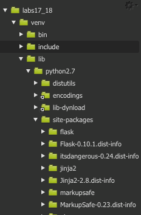

# Flask templates

This week we look at basic Flask, including how to setup and run Flask server, how you can migrate what you've done already i.e. static webpages under the control of Flask, and how to use the powerful Jinja2 template system.

Next week we'll look at how to popular forms and collect user inputs, again using Flask and SQLite. That'll conclude this module, before Easter break.

The time has come!

## Basic Flask

In last week's lab sheets, I didn't show you how to install `virtualenv`, as at that time it's insalled in all virtual machines on C9 by default. But it seems that the default settings have been changed since then. In other words, `virtualenv` and `ipython` are not installed by default. We'll have to start from there.

> By the way, a lot of us expereinced problems with C9 lately. I recommend that you register a free/trial account on [Codio](https://codio.com/), linking to the same GitHub repository that your C9 workspace is pointing to. So that if one server is down, you can use the other. In any case, you should keep pushing/pulling to make sure these two (C9 and Codio) are synchronized.


> We use the built-in web server in all our examples. However, this server is not for production environment. For that you'll need to use something such as [Apache module mod_wsgi](http://flask.pocoo.org/docs/0.10/deploying/).

### Install Flask

Open a terminal window on C9 workspace, and issue the following command `which virtualenv`. If what you see is similar to below, that means the binary (software) is not installed. You'll need to install it first of all.


Use the following command to install `virtualenv`

```bash
sudo pip install virtualenv
```

Once done, run the following to create a virtual environment called 'venv'. This step repeats from the previous lab.

```bash
virtualenv venv
```

Next, run the following to activate the newlly createed virtual envrionment, and install flask in it.

```bash
. venv/bin/activate
pip install flask
```

If everything goes well, you'll see that some new folders appear in your `venv/lib/site-packages/` folder, including serveral that begin with the work flask.



The insallation is now complete.

### Hello Flask

The tradition in teaching programming language is to start with a 'Hello world' programme. We'll do the same.

Create a new file called 'hello_flask.py' in your workspace, and insert following lines into it.

```python
from flask import Flask
import os

app = Flask(__name__);

@app.route('/')
def hello_world():
    return 'Hello World!'

if __name__ == '__main__':
    app.debug = True
    port = int(os.getenv('PORT', 8080))
    host = os.getenv('IP', '0.0.0.0')
    app.run(port=port, host=host,)
```

We'll come back to this file later. Now go into the terminal and issue the following command `python hello_flask.py`, what you'll see is similar to below


Now you have a server listening on port 8080. But we don't know the IP address! If you click the 'Share' icon to the top-right corner, a small window will pop up. Copy the 'Application' URL, that's the address you need. 


Copy and paste that URL into a new browser tab, what you'll see is similar to below


Congratulations, your first Flask website is up and running!

Now go back to the code we inserted into the file. There're several important concepts in it:

* `Flask` is a class, it accepts several different input parameters. The one we supplied is the name of the current module. This name is used to uniquely identified the current running app.
* Line begins with `@` is called a decorator. This is used to modify the function (in the current case 'hello_word()'.) The modified function then becomes assicated with route `/`, so that when a request is being sent to `/` i.e. the root folder of the website, this function will be run.
* In this example, function return a simple string. This string is internally casted into a response object, which is then returned by the server.
* The statement `__name__ == '__main__'` tests if the current file is being executed or being imported. If it's the former, this statement will evaluate to `True` and we'll run the app on specified IP address and port.

Note here PORT is an environment variable, it can be displayed in your terminal using

```bash
echo $PORT
```

Here port 8080 and IP address is required by C9, see [here](https://docs.c9.io/docs/run-an-application). If you use a different platform, it maybe different. For example, running 'hello_flask.py' on my Mac using default options gives us `http://127.0.0.1:5000`


### Routing

It's unlikely that your website has only one page. If it's more than 1 page, we need a way that directs people to different pages, depending on their request. This is called **routing**. In the previous example 'hello_flak.py' you saw a function decorator. We'll have more examples to follow.

Create a new file and name it 'hello_me.py'. Insert the following into the file_exists

```python
from flask import Flask, make_response, abort, redirect

app = Flask(__name__);

@app.route('/')
def hello_world():
    return 'Hello World!'
    
@app.route('/users')
def hello_users():
    return 'Hello everybody!'
    
@app.route('/users/<username>')
def hello_me(username):
    return 'Hello ' + username + '!'
    
@app.route('/error')
@app.route('/errors')
def error():
    response = make_response('Whoops, something goes wrong!', 404)
    return response
    
@app.route('/unexpected')
def unexpected():
    abort(404)
    return True
    
@app.route('/<path:path>')
def catch_all(path):
    return redirect('https://www.google.co.uk/search?q=' + path)

if __name__ == '__main__':
    app.run(port=8080, host='0.0.0.0', debug=True)
```

Run the code in a new browser tab as before. Try different URLs and see what the server respond

```bash
https://yourdomain.c9users.io/
https://yourdomain.c9users.io/users
https://yourdomain.c9users.io/users/yourname
https://yourdomain.c9users.io/error
https://yourdomain.c9users.io/errors
https://yourdomain.c9users.io/unexpected
https://yourdomain.c9users.io/arbitoary-long-code
```


## Jinja2 templates


