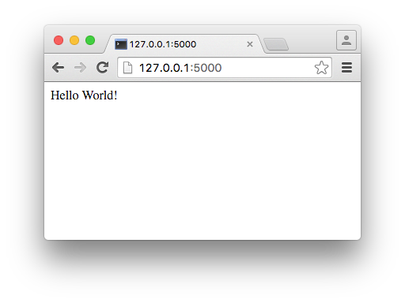
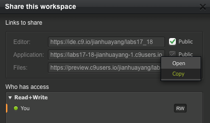
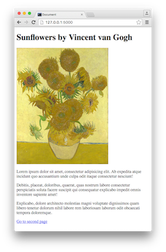
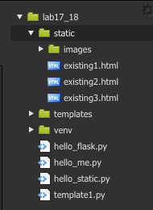

# Flask templates

This week we look at basic Flask, including how to setup and run Flask server, how you can migrate what you've done already i.e. static web pages under the control of Flask, and how to use the powerful Jinja2 templating system.

Next week we'll look at how to popular forms and collect user inputs, again using Flask and SQLite. That'll conclude this module, before Easter break.

The (difficult) time has come!

> A lot of us experienced problems with C9 lately. I recommend that you register a free/trial account on [Codio](https://codio.com/), linking to the same GitHub repository that your C9 workspace is pointing to. So that if one server is down, you can use the other. In any case, you should keep pushing/pulling to make sure these two (C9 and Codio) are synchronized.
> Some of the examples were done using my Mac, as you can tell as C9 is not very stable.

## Basic Flask

In last week's lab sheets, I didn't show you how to install `virtualenv`, as at that time it's installed in all virtual machines on C9 by default. But it seems that the default settings have been changed since then. In other words, `virtualenv` and `ipython` are not installed by default. We'll have to start from there.

> I use the built-in web server in all examples. However, this server is not for production environment. For that, you'll need to use something such as [Apache module mod_wsgi](http://flask.pocoo.org/docs/0.10/deploying/).

### Installation

Open a terminal window on the C9 workspace, and issue the following command `which virtualenv`. If what you see is similar to below, that means the binary (software) is not installed. You'll need to install it first of all.


Use the following command to install `virtualenv`

```bash
sudo pip install virtualenv
```

Once done, run the following to create a virtual environment called 'venv'. This step repeats from the previous lab.

```bash
virtualenv venv
```

Next, run the following to activate the newly created virtual environment, and install flask in it.

```bash
. venv/bin/activate
pip install flask
```

If everything goes well, you'll see that some new folders appear in your `venv/lib/site-packages/` folder, including several that begins with the work flask.


The installation is now complete.

### Hello world

The tradition in teaching programming language is to start with a 'Hello world' program. We'll do the same.

Create a new file called 'hello_flask.py' in your workspace, and insert following lines into it.

```python
from flask import Flask
import os

app = Flask(__name__);

@app.route('/')
def hello_world():
    return 'Hello World!'

if __name__ == '__main__':
    app.debug = True
    port = int(os.getenv('PORT', 8080))
    host = os.getenv('IP', '0.0.0.0')
    app.run(port=port, host=host,)
```

We'll come back to this file later. Now go into the terminal and issue the following command `python hello_flask.py`, what you'll see is similar to below



Now you have a server listening on port 8080. But we don't know the IP address! If you click the 'Share' icon at the top-right corner, a small window will pop up. Copy the 'Application' URL, that's the address you need. 



Copy and paste that URL into a new browser tab, what you'll see is similar to below


Congratulations, your first Flask website is up and running!

Now go back to the code we inserted into the file. There're several important concepts in it:

* `Flask` is a class, it accepts several different input parameters. The one we supplied is the name of the current module. This name is used to uniquely identified the currently running app.
* Line begins with `@` is called a decorator. This is used to modify the function (in the current case 'hello_word()'.) The modified function then becomes associated with route `/`, so that when a request is being sent to `/` i.e. the root folder of the website, this function will be run.
* The function is called a view function. In this example, the function returns a simple string. This string is internally cast into a response object, which is then returned by the server.
* The statement `__name__ == '__main__'` tests if the current file is being executed or being imported. If it's the former, this statement will evaluate to `True` and we'll run the app on specified IP address and port.

Note here PORT is an environment variable, it can be displayed in your terminal using

```bash
echo $PORT
```

Here port 8080 and IP address is required by C9, see [here](https://docs.c9.io/docs/run-an-application). If you use a different platform, it may be different. For example, running 'hello_flask.py' on my Mac using default options gives us `http://127.0.0.1:5000`


### Routing

It's unlikely that your website has only one page. If it's more than 1 page, we need a way that directs people to different pages, depending on their request. This is called **routing**. In the previous example 'hello_flak.py' you saw a function decorator. We'll have more examples to follow.

Create a new file and name it 'hello_me.py'. Insert the following into the file_exists

```python
from flask import Flask, make_response, abort, redirect

app = Flask(__name__);

@app.route('/')
def hello_world():
    return 'Hello World!'
    
@app.route('/users')
def hello_users():
    return 'Hello everybody!'
    
@app.route('/users/<username>')
def hello_me(username):
    return 'Hello ' + username + '!'
    
@app.route('/error')
@app.route('/errors')
def error():
    response = make_response('Oops, something goes wrong!', 404)
    return response
    
@app.route('/unexpected')
def unexpected():
    abort(404)
    return True
    
@app.route('/<path:path>')
def catch_all(path):
    return redirect('https://www.google.co.uk/search?q=' + path)

if __name__ == '__main__':
    app.run(port=8080, host='0.0.0.0', debug=True)
```

Run the code and view it in a new browser tab as before. Try different URLs and see what the server responds

```bash
https://yourdomain.c9users.io/
https://yourdomain.c9users.io/users
https://yourdomain.c9users.io/users/yourname
https://yourdomain.c9users.io/error
https://yourdomain.c9users.io/errors
https://yourdomain.c9users.io/unexpected
https://yourdomain.c9users.io/arbitoary-long-code
```

There are something new in the code above:

* `<username>` denotes a variable that can be passed to the view function. That is the function after the route decorator. In this case, we can make use of the variable to provide some customized response.
* What being returned by the server is always a response object. We can explicitly create a response object using the `make_response()` method.
* It's possible to associate one view function with different routes. We can also redirect response to a different URL.
* The last view function `catch_all` will catch any request that doesn't have a predefined route. In the example above, we redirect to Google. But it's also possible we redirect to the homepage.

### Migrate your static site

Now you've seen how to produce a simple website using Flask. What about the work you've done already? In other words, how to integrate static pages into Flask?

Suppose you have a simple HTML page called 'existing1.html' that looks like below. You also have some other pages and images that link to each other.

 

The first thing you do is to create a folder in the workspace called 'static' and put all your files there.



Next, create a file named 'hello_static.py' and insert the following code

```python
from flask import Flask, send_from_directory
app = Flask(__name__);

@app.route('/')
def send_static():
    return app.send_static_file('existing1.html')

@app.route('/<path:path>')
def send_static2(path):
    return send_from_directory('static', path)

if __name__ == '__main__':
    app.run()
```

Run the code by typing `python hello_static.py` into the terminal. You'll see that your site is being served as if it's 'standard' Apache2 server.

The job is being done by two functions:

1. `send_static_file` is an instance method. It sends a specific file in the 'static' folder. In other words, 'existing1.html' serves as the entry point of the website like 'index.html'
2. `send_from_directory` serves the file from a specific folder. In this case, it's the 'static' folder again. Whatever pages being linked within 'existing1.html' will be served using this function.

## Jinja2 templates

We have done a lot using HTML and CSS. The limit of using these two are obvious -- These are not languages, we cannot do things that are common in programming languages such as assignment, loops, inheritance.

With the help of Jinja2 template system, it's possible to do all sorts of things as mentioned above. Note that Jinja2 is part of Flask installation, but it's also a standalone templating language.

### A basic template

In order to make templating work, we'll need to components: one is the Flask app i.e. the py file, the other is an HTML file that lives in a folder called 'templates'.

Let's start with the python file.

Create a new file called 'template_basic.py', and insert the following code:

```python
from flask import Flask, render_template

app = Flask(__name__)

@app.route('/')
@app.route('/<input>')
def hello(input=None):
    return render_template('template_basic.html', name=input)
    
if __name__ == '__main__':
    app.run(port=8080, host='0.0.0.0', debug=True)
```

The only thing that is new here is the `render_template()` function. Note here it takes two input arguments: one is the HTML file that we'll create in a minute, and the other is a variable we take from the user input i.e. the variable called 'input'. This input variable is assigned to a named variable called 'name' in that function. 

Next, let's look at the HTML file. Create a folder called 'templates' and inside it create a new file called 'template_basic.html'. Insert the following into 'template_basic.html'

```html

<h1>Hello {{name|capitalize}}!</h1>

<h1>Hello World!</h1>


{# This is a comment
assignment operation use 'set' keyword
#}


<p>Lenna became famous after</p>

    {{ item }}


<p>NOT</p>

    {{ item }}


<br>


```

This may take a while to understand. 

* The code is a mix of Python code and HTML.
* Python codes are enclosed:
    *  for Statements
    * {{ ... }} for Expressions to print to the template output
    * {# ... #} for Comments not included in the template output
* `endif` and `endfor` are for ending branching and for loops. This is new and not available in Python.
* Variables are set using `set` keyword.
* There're two ways to start/end a block. If we use `{%-` instead of `{%`, the whitespaces before or after that block will be removed.
* Function `url_for()` generates a link to a static image. In this case, the image is saved in a folder called 'static/images'. This is how to combine static resource files with Jinja2.


> The image used in this example is by [Lena Söderberg](www.google.co.uk/search?q=image%20processing%20girl), who is quite famous in the digital image processing world.


### Directives

Jinja2 supports several directives that compliment standard HTML. These directives allow us to import/include/extend other templates. In the OOP context, this allows us to build is-a/has-a relationships.

For this current example, we need to create 4 HTML files:

1. template_common.html. This is a file that contains contents that are common and shared by other HTML files, for example, the navigation bar or copyright disclaimer. This file can be included using the 'include' directive.
2. template_macro.html. This file contains common operations like functions. This file can then be imported using 'import' directive into other files in a way similar to Python module.
3. template_parent.html. You guessed it, this file contains the basic structure. It serves as a 'template' so that all other files can extend this file to inherit all the structure.
4. template_oop.html. This is our targeting HTML file. It's built based on all three files mentioned above.

I'm not going to list all the contents. You can find it in the module repository. Below is a listing of 'template_oop.html'.

```html



 Best actor candidates 2016 


    {{super()}}
    <style type="text/css">
        h1 { color: #336699; }
    </style>



    
    
    {{macros.display_actors(seq)}}

```

There're several things to note here:

* We used all three directives: extend, import, and include. In all cases, it takes file name in a string format.
* Blocks can have named eng tags. For example, the list line above could be changed to ``
* The `super()` method gives back the results of the parent block.
* Expression values not included in any HTML tags are not being displayed. For example, if line `{{macros.display_actors(seq)}}` moves to the outside of any blocks, the names won't be shown on the web page.

Run file 'template_oop.py' and your websiet should look like below:


### Flask-Bootstrap

It's possible to integrate Bootstrap with Flask. But this relies on a separate extension called flask-bootstrap. In your terminal and type in `pip install flask-bootstrap` to install it.

Create a Python file called template_bootstrap.py' and insert the following

```python
from flask import Flask, render_template
from flask.ext.bootstrap import Bootstrap

app = Flask(__name__)

@app.route('/')
def nominee():
    return render_template('template_bootstrap.html')
    
if __name__ == '__main__':
    Bootstrap(app)
    app.run(port=8080, host='0.0.0.0', debug=True)
```

The only thing that is new here is the Bootstrap class. Basically, this class adds all resources that are necessary to run Bootstrap to the app such as links to jQuery and CSS etc.

In the templates folder, create a file called 'template_bootstrap.html' and insert the following code:

```html



 Best actor candidates 2016 


   <div class="container"></div>



    
    <div class="container"><div class="well">{{macros.display_actors(seq)}}</div></div>

```

Basically, the Python extension provides a template that has a number of empty blocks. We inherit it by using `extends 'bootstrap/base.html'`. We also provide some customized definitions for the different blocks. The rest such different classes in `div` tags, this is the same as in the Bootstrap CSS files.

By using Bootstrap, the page we created earlier changes to the following


