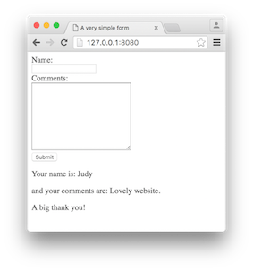
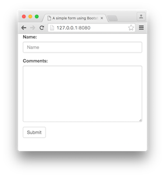
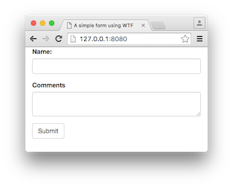

# Flask SQLite

Last week we looked at how to combine HTM/CSS with the Python language using Jinja2 templating system. This combination is very powerful as it overcomes some limitations associated with HTML such as the lack of flow control mechanisms. 

This week we'll rely on Python language's SQL handling capabilities to build websites that are capable of connecting/manipulating data in a relational database. The exercises that follow conclude the current module.

## Forms in Flask

Before you manipulate data using SQLite, you need to collect user inputs using forms. There are several different ways of presenting forms in Flask, obviously, they all have pros/cons. Let's examine them all.

### Pure HTML forms

In your C9 workspace, create a new file called 'form_simple.html' and put it in a folder called 'templates' (note: plural, not template). Insert the following code into this file.

```html
<!doctype html>
<html lang="en">
<head>
    <meta charset="UTF-8">
    <title>A very simple form</title>
</head>
<body>
<form action="" method="post">
    <label for="nameId">Name:</label>
    <br>
    <input type="text" name="name" id="nameId">
    <br>
    <label for="commentsId">Comments:</label>
    <br>
    <textarea name="comments" id="commentsId" cols="30" rows="10"></textarea>
    <br>
    <input type="submit" value="Submit">
</form>


    <p> Your name is: {{ name }}</p>
    <p>and your comments are: {{ comments }}</p>
    <p>A big thank you!</p>


</body>
</html>
```

If you did last week's exercises, this is easy to understand -- it's just a simple Jinja2 template with a standard HTML form in it.

Next, in workspace folder create a file called 'form_simple.py' and insert the following code

```python
from flask import Flask, render_template, request

app = Flask(__name__)


@app.route('/', methods=['GET', 'post'])
def view_form():
    if request.method == 'POST':
        name = request.form['name'];
        comments = request.form['comments']
        return render_template('form_simple.html', name=name, comments=comments)
    else:
        return render_template('form_simple.html')


if __name__ == '__main__':
    app.run(port=8080, host='0.0.0.0', debug=True)
```

The majority of the code should look familiar, apart from the following two:

1. The function decorator takes an additional 'method' argument. By default (without the 'method' argument), the current route i.e. `/` will only respond to `GET` method. That's what happens when people try to view webpages. However, when they try to send data in a form, they will have to specify either 'POST' or 'PUT' in the form's `method` attribute. When you design your route, you'll need to respond to that **HTTP method**.
2. 'request' here is an object that encapsulates the contents of an HTTP request sent by the client (normally a browser). Here we use it to access the data contained in the form. 

If you run the code, type in something and hit 'submit', what you'll see is similar to below. The info you just typed in has been displayed back.



> Last week we had some problems with C9, and I suggested that you register a free trial account on Codio that lasts for 30 days (only). In case needed, you may consider getting [PyCharm](https://www.jetbrains.com/student/) installed on your desktop, which normally costs £149 a year but is free for educational purposes. At the moment, you don't have to do this as C9 came back to normal.

> 

### Bootstrap forms

Obviously pure HTML forms work, but as you can see it doesn't look very nice. Using the Flask-Bootstrap extension we can take advantage of existing CSS rules in Bootstrap.


Create a new file called 'form_bootstrap.py', and insert the following code

```python
from flask import Flask, render_template, request
from flask_bootstrap import Bootstrap

app = Flask(__name__)
Bootstrap(app)

@app.route('/')
def view_form():
    return render_template('form_bootstrap.html')


if __name__ == '__main__':
    app.run(port=8080, host='0.0.0.0', debug=True)
```

This is a standard Flask app using Bootstrap, the same as what we saw in the previous lab. 

Next, create a file called 'form_bootstrap.html' and put into the templates folder. Insert the following lines into this newly created file.

```html



    A simple form using Bootstrap



    <div class="container">
        <form action="" method="post">
            <div class="form-group">
                <label for="nameId">Name:</label>
                <input type="text" name="name" id="nameId" class="form-control" placeholder="Name">
            </div>
            <div class="form-group">
                <label for="commentsId">Comments:</label>
                <textarea name="comments" id="commentsId" rows="8" class="form-control"></textarea>
            </div>

            <button type="submit" class="btn btn-default">Submit</button>
        </form>
    </div>


```

This HTML template has the same number of input fields as the pure HTML example, but it uses the Bootstrap format:

* The form is being contained in a 'container' class.
* Input fields and associated labels are grouped using the 'form-group' class.
* Input fields are marked using the 'form-control' class.
* Submit button has been assigned the 'btn' and 'btn-default' classes.

If you run the code you'll see that the form looks much better as it inherits all Bootstrap rules and interactivities.



> The recommendation from Bootstrap is to *"void using `textarea` elements as their rows attribute will not be respected in some cases"*, see [here](http://getbootstrap.com/components/#input-groups).

### Forms using WTF

Bootstrap was covered earlier in the module, in lab12. The only reason we need to re-visit is to prepare for the Flask extension Flask-WTF, which offers a simple wrapper around WTForms. WTForms is a flexible forms validation and rendering library for python web development that turns the whole form into classes and objects.

Create a new file and name it 'form_wtf.py'. Insert the following code into it

```python
from flask import Flask, render_template
from flask_bootstrap import Bootstrap
from flask_wtf import Form
from wtforms import StringField, TextAreaField, SubmitField
from wtforms.validators import DataRequired, Length

app = Flask(__name__)
app.config['SECRET_KEY'] = 'hard to guess string'
Bootstrap(app)


class CommentForm(Form):
    name = StringField('Name:', validators=[DataRequired()])
    comments = TextAreaField('Comments', validators=[DataRequired(), Length(min=3, max=10)])
    submit = SubmitField('Submit')


@app.route('/', methods=['GET', 'POST'])
def view_form():
    form = CommentForm()
    if form.validate_on_submit():
        name = form.name.data
        comments = form.comments.data
        form.name.data = ''
        form.comments.data = ''
        return render_template('form_wtf.html', form=form, name=name, comments=comments)
    return render_template('form_wtf.html', form=form)


if __name__ == '__main__':
    app.run(port=8080, host='0.0.0.0', debug=True)
```

There are quite a lot of things going on in the example above:

* The `SECRET_KEY` configuration variable is used as a general-purpose encryption key by Flask and several third-party extensions. This is required against [Cross-Site Request Forgery (CSRF)](https://en.wikipedia.org/wiki/Cross-site_request_forgery).
* We created a class called CommentForm that inherits from the Form class that comes with package flask_wtf. This class is being used as the form in an ordinary HTML context.
* This CommentForm class has three attributes, corresponding to the three form controls we have. Note here these attributes are field objects themselves, imported from a different module called 'wtforms'.
* Form controls i.e. fields can have validators. These are imported classes. The differences between these Python validators and JS validators we saw earlier in the module is that **some** Python validators need to be run on the server. That is, the form is passed to the server first to get validation.
* Form objects have an instance function called `validate_on_submit()`. Basically, if the form validates fine, this function will evaluate to true, and the sub-block will run.
* The form, as an object, is used to present and also to hold user input data. So `form.name.data` denotes the user's response in the name field. And so it's necessary we replace user submitted value by an empty string before re-send it out to the user again.
> If you Google online, you'll notice that some tutorial use 'data_required()' or 'required()' instead of 'DataRequired()'. In fact, 'data_required' is the same as 'DataRequired()', and  'required()' is the legacy version of the same thing.

Now, create a file called 'form_wtf.html' and put inside the templates folder. Insert the following lines into this file

```html




    A simple form using WTF



    <div class="container">
        {{ wtf.quick_form(form) }}

        
            <p> Your name is: {{ name }}</p>
            <p>and your comments are: {{ comments }}</p>
            <p>A big thank you!</p>
        
    </div>


```

With the help of WTF form object, rendering the form becomes an easy job. All you need is to call the `quick_form()` macro and give your form as input. The rest of the template above displays user inputs back in the same way as in the pure HTML example.



## SQLite integration

Data collected using forms allows us to do various manipulations, which is not possible using standard HTML/CSS techniques.

### Prepare database

In your workspace create a new file and name it 'schema.sql'. Insert the following code into it

```sql
DROP TABLE IF EXISTS comments_table;


CREATE TABLE comments_table (
    id integer PRIMARY KEY,
    name text NOT NULL,
    comments text NOT NULL
    );
```

Go to terminal and insert the following command and hit `Enter`

```bash
sqlite3 comments.db < schema.sql
```

Command above will invoke the SQLite3 executable and run SQL commands saved in file 'schema.sql'. This essentially creates a database file called 'comments.db' and create a table named 'comments_table' inside.

### Collect and display data

Create a new file and name it 'flask_sqlite.py' and insert the following code

```python
from flask import Flask, render_template, redirect, url_for
import os
from flask_bootstrap import Bootstrap
from flask_wtf import Form
from wtforms import StringField, TextAreaField, SubmitField
from wtforms.validators import DataRequired, Length
import sqlite3

app = Flask(__name__)
app.config.update(dict(
    DATABASE=os.path.join(app.root_path, 'comments.db'),
    SECRET_KEY='development key'
))
Bootstrap(app)

class CommentForm(Form):
    name = StringField('Name:', validators=[DataRequired()])
    comments = TextAreaField('Comments', validators=[DataRequired(), Length(min=3, max=10)])
    submit = SubmitField('Submit')

@app.route('/', methods=['GET', 'POST'])
def view_form():
    form = CommentForm()
    if form.validate_on_submit():
        name = form.name.data
        comments = form.comments.data
        with sqlite3.connect(app.config['DATABASE']) as con:
            cur = con.cursor()
            cur.execute("INSERT INTO comments_table (name, comments) VALUES (?,?)", (name, comments))
            con.commit()

        return redirect(url_for('list_results'))
    return render_template('form_wtf.html', form=form)

@app.route('/display')
def list_results():
    with sqlite3.connect(app.config['DATABASE']) as con:
        con.row_factory = sqlite3.Row
        cur = con.cursor()
        cur.execute("SELECT * FROM comments_table")
        entries = cur.fetchall()
        return render_template('flask_sqlite.html', entries=entries)

if __name__ == '__main__':
    app.run(port=8080, host='0.0.0.0', debug=True)
```

In the code above:

* `app.config.update()` takes a dictionary as inputs. `app.config` is [a subclass of a dictionary and can be modified just like any dictionary](http://flask.pocoo.org/docs/0.10/config/). The `update()` method update multiple keys at once.
* In the app we have two routes defined to handle two different user request:
    1. The root of the website i.e. `/` represents a form. Once submitted, the `view_firm()` function will save the data submitted and redirect to `/display`. The `with sqlite3.connect(app.config['DATABASE']) as con` block is responsible for saving the data into the database file we defined previously. Basically, we get a connection object first, from which we get a cursor and then execute raw SQL queries. See some more examples on [the official Python SQLite3 documentation](https://docs.python.org/2/library/sqlite3.html) for this.
    2. The other route is for URL `/display`. It will query the database and the given outputs will be passed on to a template to display the results. The line `con.row_factory = sqlite3.Row` will turn the default output format (tuple) into a dictionary, which is much easier to manipulate.
* Othe CRUD operations are similar. Note in both view function, we request to open the database, but we didn't close it after use. This is due to the `with` statement, which ensures the handle to the database is closed properly after the current block.

Create a file called 'flask_sqlite.html' and put into the templates folder. Insert the following code into this file_exists

```html




    A simple form using SQLite



    <div class="container">

        <ul class="entries">
            
                <li><h2>{{ entry.name|capitalize }}</h2>{{ entry.comments }}
            
        </ul>


    </div>


```

Once we have the output from SQLite database, the template is relatively easy to do. In the code above, we iterate through all query outputs and display in a list. Note here we didn't close the `li` tag as it's self-closing.

If you type in some names/comments in the form and click submit, you should see something similar to below


The database file 'comments.db' can be downloaded and visualized using for example [SQLiteStudio](http://sqlitestudio.pl/).


## Extensions (N.B.: advanced)

So far in this module, we have learned some extensions such as Flask-Bootstrap and Flask-WTF. Apart from these two, there are [a large number of extesions](http://flask.pocoo.org/extensions/) covering almost everything one can think of.

* [Flask-Script](http://github.com/techniq/flask-script/) provides support for writing external scripts in Flask. 
* [Flask-SQLAlchemy](https://github.com/mitsuhiko/flask-sqlalchemy/) is a wrapper for [SQLAlchemy](http://www.sqlalchemy.org/) which, in simple terms, turns relational SQL tables into models a.k.a. classes.
* [Flask-Mail](http://pythonhosted.org/Flask-Mail/) allows your user to send emails using a mail server or an existing email account such as your Gmail account.

> 

> There's a new book came out recently using [Zootopia's Flash](http://disney.wikia.com/wiki/Flash) as the cover image. Grab a copy of the book and see if it makes sense.


